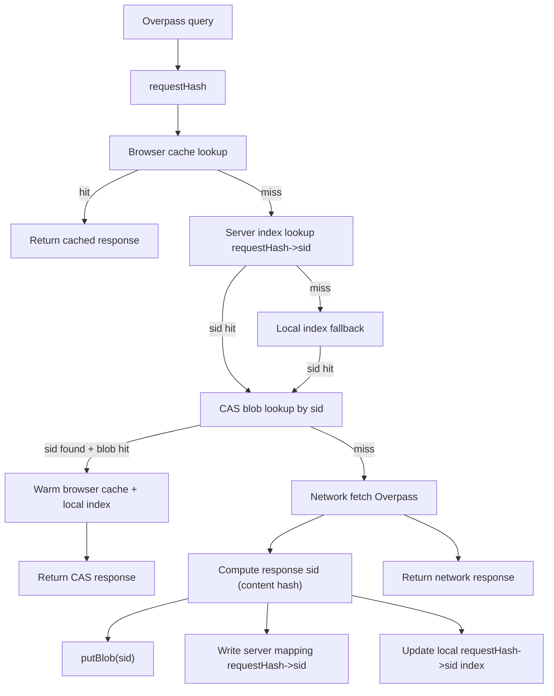

# Hybrid Overpass + CAS Cache

## Goal
Reduce repeated OSM refetches by adding a hybrid cache path for Overpass responses, while keeping CAS content-addressed.

## Design Decisions
- **L1 cache (browser):** existing `Cache API` remains first lookup for lowest latency.
- **L2 cache (CAS, optional):** used only when CAS is available/enabled.
- **Content-addressed invariant:** CAS blobs remain keyed by **response content hash** (`sid`), never by request hash.
- **Request-hash index:** maps `requestHash -> sid + metadata`; local copy for fast fallback, server copy for cross-client reuse.
- **TTL:** long default TTL (multi-day), with manual clear/refresh support.

## Implementation Plan

### 1) Add Overpass cache key + metadata model
Update [`src/maps/api/overpass.ts`](/Users/ryantseng/projects/JetLagHideAndSeek/src/maps/api/overpass.ts) and [`src/maps/api/types.ts`](/Users/ryantseng/projects/JetLagHideAndSeek/src/maps/api/types.ts):
- Add helper to compute deterministic `requestHash = sha256(canonicalQueryString + endpoint + versionTag)`.
- Add typed metadata shape:
  - `requestHash`
  - `sid` (response hash)
  - `cachedAt`
  - `expiresAt`
  - `source` (`local` | `cas` | `network`)

### 2) Add client-side Overpass index store (requestHash -> sid)
Update [`src/lib/context.ts`](/Users/ryantseng/projects/JetLagHideAndSeek/src/lib/context.ts):
- Add persistent atom for Overpass index map (bounded size via LRU-style pruning).
- Store only metadata pointers (no large payloads in atom/localStorage).

### 3) Add CAS server endpoints for shared requestHash mapping
Update CAS server routes/controllers:
- Add `GET /api/cas/index/overpass/:requestHash`:
  - returns mapping `{ sid, cachedAt, expiresAt }` when present and valid.
- Add `PUT /api/cas/index/overpass/:requestHash`:
  - upserts mapping payload with TTL metadata.
- Add TTL pruning/expiry enforcement for this mapping table/collection.
- Keep CAS blobs content-addressed and unchanged (`sid` remains blob key).

### 4) Extend cache flow with hybrid lookup
Update [`src/maps/api/cache.ts`](/Users/ryantseng/projects/JetLagHideAndSeek/src/maps/api/cache.ts):
- Introduce Overpass-aware lookup function used by `getOverpassData`:
  1. Check existing browser cache by URL.
  2. If miss/stale and CAS available, query server mapping endpoint by `requestHash`.
  3. If server miss, fallback to local index lookup.
  4. If `sid` found, try CAS `getBlob(baseUrl, sid)`.
  5. On CAS hit, return response and warm browser cache and local index.
  6. On miss, perform network fetch.
- Keep existing in-flight dedup and toasts.

### 5) Write-through with content-addressed CAS blobs
Update [`src/maps/api/overpass.ts`](/Users/ryantseng/projects/JetLagHideAndSeek/src/maps/api/overpass.ts) and leverage [`src/lib/cas.ts`](/Users/ryantseng/projects/JetLagHideAndSeek/src/lib/cas.ts):
- After successful Overpass network response:
  - canonicalize response text/json
  - compute response `sid` via existing `computeSidFromCanonicalUtf8`
  - `putBlob` to CAS (if available)
  - write server mapping `requestHash -> sid + TTL metadata`
  - update local index entry `requestHash -> sid` with long TTL
- Keep CAS optional/non-blocking; network result should still be returned if CAS write fails.

### 6) Integrate with existing controls and invalidation
- Reuse existing `clearCache` for browser cache invalidation.
- Add helper to clear/prune local Overpass index entries (stale or oversized).
- Add endpoint(s) or server-side policy for invalidating/pruning requestHash mappings.
- Optionally wire a manual “refresh OSM cache” action later (non-blocking for this phase).

## Data Flow

## Files to Touch
- [`src/maps/api/overpass.ts`](/Users/ryantseng/projects/JetLagHideAndSeek/src/maps/api/overpass.ts)
- [`src/maps/api/cache.ts`](/Users/ryantseng/projects/JetLagHideAndSeek/src/maps/api/cache.ts)
- [`src/maps/api/types.ts`](/Users/ryantseng/projects/JetLagHideAndSeek/src/maps/api/types.ts)
- [`src/lib/context.ts`](/Users/ryantseng/projects/JetLagHideAndSeek/src/lib/context.ts)
- (reuse existing CAS primitives in) [`src/lib/cas.ts`](/Users/ryantseng/projects/JetLagHideAndSeek/src/lib/cas.ts)
- CAS server route/controller files for `/api/cas/index/overpass/*`

## Validation
- Verify repeated load uses L1/L2 and avoids Overpass refetch.
- Verify cross-client reuse: client B resolves `requestHash -> sid` from server mapping and reuses CAS blob without hitting Overpass.
- Verify CAS unavailable path gracefully falls back to network.
- Verify content-addressed CAS invariant: same response -> same sid across requests.
- Run typecheck/lints and trace one first-load + one repeat-load scenario.